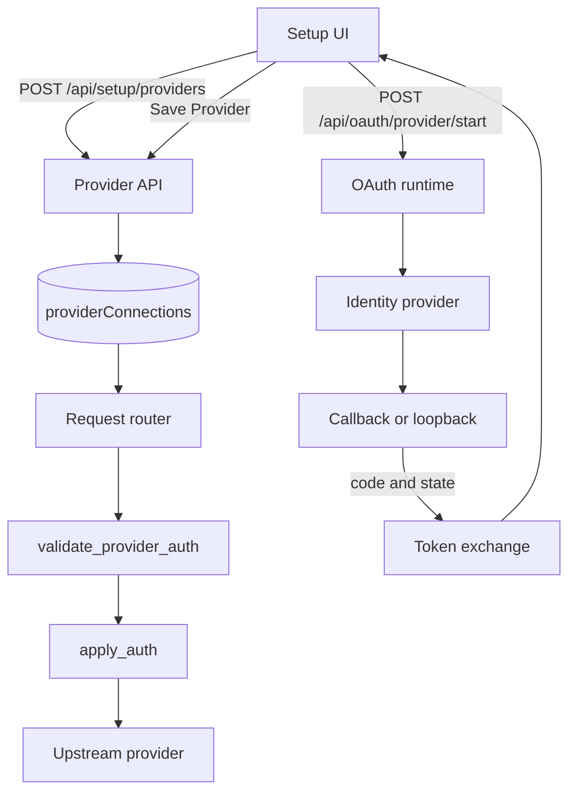
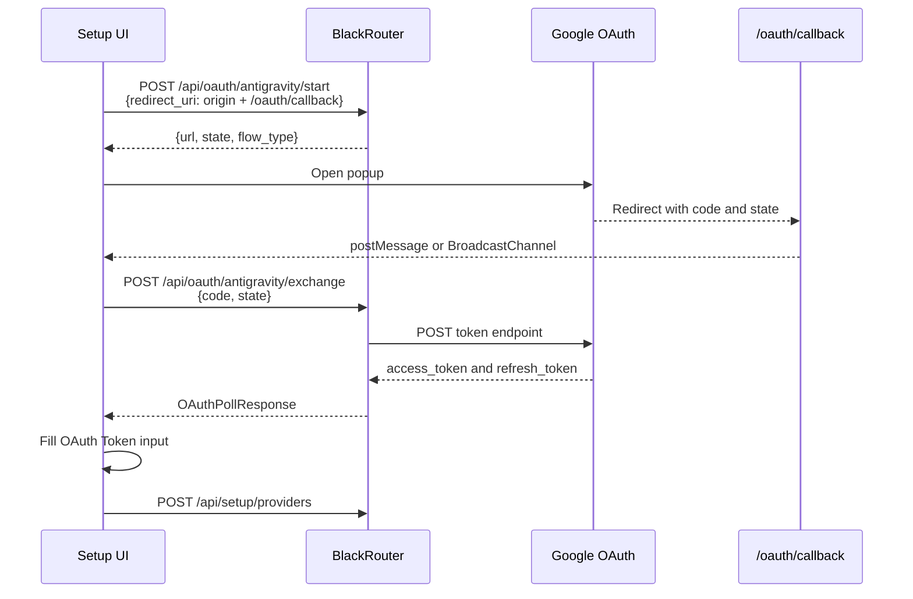

# Cơ chế xác thực Provider trong BlackRouter

Tài liệu này mô tả cách BlackRouter cấu hình, lưu trữ, áp dụng và kiểm tra thông tin xác thực của upstream provider. Nội dung bám theo implementation hiện tại trong:

- `crates/blackrouter-api/src/lib.rs`
- `crates/blackrouter-api/src/oauth.rs`
- `crates/blackrouter-api/static/pages.js`
- `crates/blackrouter-api/static/setup.js`
- `crates/blackrouter-providers/src/lib.rs`
- `crates/blackrouter-storage/src/lib.rs`

Các pattern OAuth và provider testing được đối chiếu với `9router-master`, nhưng bảng trạng thái trong tài liệu này chỉ mô tả những gì BlackRouter hiện đang hỗ trợ.

## 1. Tổng quan kiến trúc

Một provider connection gồm hai nhóm dữ liệu:

1. Metadata có schema cố định: `provider`, `auth_type`, `name`, `priority`, `is_active`, `status`, ...
2. Dữ liệu mở trong object `data`: endpoint, format, credential và header riêng của provider.



> OAuth exchange hiện trả token về form Setup. Provider connection chỉ được lưu khi người dùng bấm **Add Provider** hoặc **Save Provider**.

## 2. Schema provider connection

Payload tạo hoặc cập nhật provider:

```json
{
  "provider": "openai",
  "auth_type": "api-key",
  "name": "OpenAI primary",
  "email": null,
  "priority": 1,
  "is_active": true,
  "data": {
    "baseUrl": "https://api.openai.com/v1/chat/completions",
    "format": "openai",
    "authType": "api-key",
    "apiKey": "sk-..."
  }
}
```

### Quy ước tên field trong `data`

Các field do Setup UI và runtime sử dụng là **camelCase**:

| Field | Ý nghĩa |
|---|---|
| `baseUrl` | URL endpoint upstream |
| `format` | Wire format: `openai`, `claude`, `gemini`, `antigravity`, `openai-responses`, ... |
| `authType` | Bản sao của `auth_type` phục vụ tương thích dữ liệu |
| `apiKey` | API key, bearer token hoặc OAuth access token |
| `accessToken` | Tên thay thế được runtime chấp nhận cho access token |
| `token` | Tên thay thế chung cho token |
| `username` | Username của Basic Auth |
| `password` | Password của Basic Auth |
| `headerName` | Tên custom authentication header |
| `headerValue` | Giá trị custom authentication header |
| `headers` | Object chứa các header bổ sung luôn được gửi lên upstream |
| `refreshToken` | Refresh token nếu provider cấp; chưa được mọi flow tự động sử dụng |
| `projectId` | Project ID của provider như Antigravity |

Runtime tìm bearer credential theo thứ tự:

1. `data.apiKey`
2. `data.api_key` để tương thích dữ liệu cũ
3. `data.accessToken`
4. `data.token`

> `baseUrl` và `format` phải nằm trong `data`. Các field top-level `base_url` hoặc `format` không thuộc schema `NewProviderConnection` và không phải nguồn dữ liệu routing.

## 3. Các loại xác thực

BlackRouter runtime hỗ trợ sáu giá trị `auth_type`:

| `auth_type` | Credential trong `data` | Cách gửi lên upstream |
|---|---|---|
| `api-key` | `apiKey` | `Authorization: Bearer <token>` |
| `bearer` | `apiKey`, `accessToken` hoặc `token` | `Authorization: Bearer <token>` |
| `oauth` | `apiKey`, `accessToken` hoặc `token` | `Authorization: Bearer <token>` |
| `basic` | `username`, `password` | HTTP Basic Authentication |
| `header` | `headerName`, `headerValue` | Header tùy chỉnh |
| `none` | Không cần credential | Không thêm authentication header |

Ngoài authentication header, `data.headers` luôn được áp dụng trước. Cơ chế này dùng cho các header provider-specific như version, client metadata hoặc session header.

### 3.1 API key

Ví dụ OpenAI-compatible provider:

```json
{
  "provider": "deepseek",
  "auth_type": "api-key",
  "name": "DeepSeek",
  "is_active": true,
  "data": {
    "baseUrl": "https://api.deepseek.com/chat/completions",
    "format": "openai",
    "authType": "api-key",
    "apiKey": "<deepseek-api-key>"
  }
}
```

Phù hợp với các provider trong catalog như OpenAI API, Anthropic, Gemini API, DeepSeek, Groq, xAI, Mistral, Perplexity, Together AI, Fireworks, NVIDIA NIM, OpenRouter, Cline và Command Code.

### 3.2 Bearer token

Dùng khi upstream cấp bearer token nhưng không cần OAuth flow do BlackRouter quản lý:

```json
{
  "provider": "custom-service",
  "auth_type": "bearer",
  "data": {
    "baseUrl": "https://service.example/v1/chat/completions",
    "format": "openai",
    "apiKey": "<bearer-token>"
  }
}
```

### 3.3 Basic Auth

```json
{
  "provider": "custom-basic",
  "auth_type": "basic",
  "data": {
    "baseUrl": "https://service.example/chat",
    "format": "openai",
    "username": "user",
    "password": "password"
  }
}
```

Cả `username` và `password` đều bắt buộc.

### 3.4 Custom header

```json
{
  "provider": "custom-header",
  "auth_type": "header",
  "data": {
    "baseUrl": "https://service.example/chat",
    "format": "openai",
    "headerName": "X-API-Key",
    "headerValue": "<secret>"
  }
}
```

Nếu không có `headerValue`, runtime có thể dùng `apiKey` làm giá trị header.

### 3.5 Không xác thực

```json
{
  "provider": "ollama-local",
  "auth_type": "none",
  "data": {
    "baseUrl": "http://localhost:11434/v1/chat/completions",
    "format": "openai"
  }
}
```

Provider catalog hiện có `opencode` và `ollama-local` thuộc nhóm này.

### 3.6 OAuth token

Sau khi OAuth hoàn tất, access token được đặt vào trường token của form. Khi lưu provider, Setup UI ghi token vào `data.apiKey`:

```json
{
  "provider": "antigravity",
  "auth_type": "oauth",
  "data": {
    "baseUrl": "https://cloudcode-pa.googleapis.com",
    "format": "antigravity",
    "authType": "oauth",
    "apiKey": "<oauth-access-token>"
  }
}
```

## 4. OAuth API

Các route OAuth được mount dưới `/api`:

| Method | Endpoint | Chức năng |
|---|---|---|
| `POST` | `/api/oauth/{provider}/start` | Khởi tạo session và trả authorization URL hoặc device code |
| `GET` | `/api/oauth/{provider}/callback` | Server-side callback và token exchange |
| `POST` | `/api/oauth/{provider}/exchange` | Exchange code hoặc poll device code |
| `GET` | `/api/oauth/{provider}/status?state=...` | Đọc trạng thái OAuth session |
| `GET` | `/oauth/callback` | Callback relay page cho popup cùng origin |

Provider được `oauth_start` hỗ trợ:

- `github`
- `google`
- `gemini`
- `antigravity`
- `codex`
- `openai`

`cursor` và `kiro` có `auth_type: oauth` trong catalog nhưng chưa có interactive server flow trong `oauth_start`. Hiện tại cần nhập token thủ công.

## 5. OAuth session

OAuth session được lưu trong memory của process:

```rust
struct OAuthSession {
    provider: String,
    code_verifier: Option<String>,
    access_token: Option<String>,
    refresh_token: Option<String>,
    email: Option<String>,
    project_id: Option<String>,
    expires_at: Option<String>,
    redirect_uri: Option<String>,
    status: String,
    error: Option<String>,
}
```

Trạng thái:

- `pending`: đang chờ người dùng hoặc token exchange
- `done`: đã nhận access token
- `error`: flow thất bại

### Giới hạn session hiện tại

- Session không được persist xuống SQLite.
- Restart process làm mất toàn bộ OAuth session đang chạy.
- Session chưa có cleanup TTL tự động.
- Không phù hợp cho nhiều replica nếu không có shared session store.
- `state` hiện được sinh trong process và cần tiếp tục được tăng cường entropy trước khi dùng trong môi trường bảo mật cao.

## 6. Authorization Code Flow qua popup

Google, Gemini và Antigravity dùng Authorization Code Flow.



### Redirect URI invariant

`redirect_uri` dùng trong token exchange phải giống tuyệt đối với giá trị dùng trong authorization URL. BlackRouter lưu giá trị này trong OAuth session và đọc lại bằng `session_redirect_uri()`.

Nếu hai giá trị khác nhau, provider thường trả `invalid_grant`, `redirect_uri_mismatch` hoặc response không có `access_token`.

### Callback relay

`/oauth/callback` đọc `code` và `state`, sau đó gửi kết quả về cửa sổ Setup bằng:

- `window.opener.postMessage`
- `BroadcastChannel("br_oauth")`
- `BroadcastChannel("oauth_callback")`
- `localStorage` làm fallback

Frontend hỗ trợ cả payload trực tiếp và payload được bọc trong `{ type, data }`.

## 7. Antigravity OAuth và onboarding

Antigravity dùng Google Authorization Code Flow với các scope:

- `https://www.googleapis.com/auth/cloud-platform`
- `https://www.googleapis.com/auth/userinfo.email`
- `https://www.googleapis.com/auth/userinfo.profile`
- `https://www.googleapis.com/auth/cclog`
- `https://www.googleapis.com/auth/experimentsandconfigs`

Sau token exchange, BlackRouter gọi:

1. `POST https://cloudcode-pa.googleapis.com/v1internal:loadCodeAssist`
2. Đọc `cloudaicompanionProject` và tier mặc định
3. `POST https://cloudcode-pa.googleapis.com/v1internal:onboardUser`
4. Poll tối đa 10 lần cho đến khi onboarding trả `done: true`

Request dùng client metadata tương thích Antigravity/Cloud Code:

```json
{
  "ideType": 9,
  "platform": 3,
  "pluginType": 2
}
```

Platform enum:

| Hệ điều hành | Giá trị |
|---|---:|
| macOS x86_64 | 1 |
| macOS ARM64 | 2 |
| Linux x86_64 | 3 |
| Linux ARM64 | 4 |
| Windows | 5 |
| Khác | 0 |

OAuth client mặc định có thể được override bằng:

```bash
OAUTH_ANTIGRAVITY_CLIENT_ID=
OAUTH_ANTIGRAVITY_CLIENT_SECRET=
```

Không ghi client secret thực tế vào tài liệu, log, issue hoặc screenshot.

## 8. Codex/OpenAI OAuth với PKCE

Codex và alias `openai` dùng Authorization Code + PKCE:

1. BlackRouter tạo `code_verifier` ngẫu nhiên.
2. Tính `code_challenge = BASE64URL(SHA256(code_verifier))`.
3. Khởi chạy loopback callback tạm thời tại `127.0.0.1:1455`.
4. Authorization URL dùng `http://localhost:1455/auth/callback`.
5. Callback exchange code với cùng `redirect_uri` và `code_verifier`.
6. Access token và email từ `id_token` được lưu trong OAuth session.

Các tham số OpenAI-specific:

- `id_token_add_organizations=true`
- `codex_cli_simplified_flow=true`
- `originator=codex_cli_rs`

Nếu port `1455` không bind được, flow tiếp tục với manual fallback, nhưng browser vẫn phải truy cập được loopback callback đã đăng ký với OpenAI OAuth client.

## 9. GitHub Copilot Device Code Flow

Flow API:

1. `POST /api/oauth/github/start`
2. Backend gọi GitHub device code endpoint.
3. Response trả `user_code`, `verification_uri`, `expires_in`, `interval` và `state`.
4. Người dùng mở `verification_uri` và nhập `user_code`.
5. Client gọi lặp `POST /api/oauth/github/exchange` với `state` cho đến khi không còn `authorization_pending`.
6. Backend đổi GitHub access token lấy Copilot token.

Response khởi tạo mẫu:

```json
{
  "url": "https://github.com/login/device",
  "state": "session-state",
  "provider": "github",
  "flow_type": "device_code",
  "user_code": "ABCD-1234",
  "verification_uri": "https://github.com/login/device",
  "expires_in": 900,
  "interval": 5
}
```

> Lưu ý implementation: endpoint `/status` chỉ đọc session; nó không tự gọi GitHub token endpoint. Device flow phải poll `/exchange`. Nếu frontend chỉ poll `/status`, session sẽ tiếp tục ở trạng thái `pending`.

## 10. Provider catalog và mức hỗ trợ

Catalog lấy từ `GET /api/setup/provider-catalog`.

| Provider | Catalog auth | Interactive OAuth | Ghi chú |
|---|---|---|---|
| Antigravity | `oauth` | Có | Google OAuth + Code Assist onboarding |
| GitHub Copilot | `oauth` | Có | Device Code Flow |
| Codex | `oauth` | Có | OpenAI PKCE + loopback port 1455 |
| Cursor | `oauth` | Chưa | Nhập session token thủ công |
| Kiro | `oauth` | Chưa | Nhập OAuth token thủ công |
| OpenAI API | `api-key` | Có thể chọn `oauth` thủ công | `openai` trong OAuth route là alias Codex; catalog mặc định vẫn là API key |
| Gemini API | `api-key` | Có route `gemini`/`google` | Catalog mặc định dùng AI Studio API key |
| OpenCode | `none` | Không cần | Local endpoint |
| Ollama Local | `none` | Không cần | Local endpoint |
| Các provider còn lại | Chủ yếu `api-key` | Không | Bearer qua `Authorization` mặc định |

## 11. Áp dụng credential vào request

`apply_auth()` thực hiện:

```text
1. Thêm mọi entry trong data.headers
2. Chọn strategy theo auth_type
3. none   -> không thêm auth
4. basic  -> reqwest basic_auth(username, password)
5. header -> request.header(headerName, headerValue)
6. còn lại -> request.bearer_auth(provider_token(data))
```

Một số provider có header bổ sung ngoài `apply_auth()`:

- Command Code: `x-command-code-version`, `x-cli-environment`, `x-session-id`
- Codex: `originator`, `User-Agent`, `Accept`
- Những provider khác có thể dùng `data.headers`

## 12. Kiểm tra provider connection

Endpoint:

```http
POST /api/setup/providers/{id}/test
```

Luồng kiểm tra:

1. Đọc raw provider connection để có credential thật.
2. Kiểm tra `data.baseUrl`.
3. Kiểm tra credential theo `auth_type`.
4. Chọn `HEAD`, `GET` hoặc `POST` theo `format`.
5. Áp dụng auth và provider-specific headers.
6. Phân loại HTTP status thành reachable/authenticated/error.

### Validation trước request

| Auth type | Điều kiện hợp lệ |
|---|---|
| `none` | Luôn hợp lệ |
| `basic` | Có `username` và `password` |
| `header` | Có `headerName` và `headerValue` hoặc `apiKey` |
| Còn lại | Có một trong `apiKey`, `api_key`, `accessToken`, `token` |

### Phương thức probe

Các format sau dùng `POST`:

- `antigravity`
- `commandcode`
- `kiro`
- `cursor`
- `openai`
- `openai-chat`
- `openai-responses`

Format khác thử `HEAD`, rồi fallback sang `GET` khi `HEAD` lỗi transport.

### Diễn giải status

- `200..399`: endpoint reachable
- `400` hoặc `422` cho minimal POST body: endpoint reachable, request body kiểm tra chưa đầy đủ
- `401` hoặc `403`: endpoint reachable nhưng authentication thất bại
- `404`: host reachable nhưng endpoint sai
- `405`: endpoint reachable nhưng yêu cầu POST

Antigravity hiện coi `400`, `401`, `403` là endpoint reachable và trả thông báo login required. Vì vậy kết quả test Antigravity có thể xác nhận khả năng kết nối nhưng chưa đảm bảo token có quyền truy cập model.

## 13. Health probe nền

Khi `health_probe_enabled` được bật, BlackRouter định kỳ test mọi active provider:

- Thành công: reset failure counter, đặt status `healthy`.
- Thất bại trước threshold: đặt `degraded`.
- Đạt failure threshold: đặt `unhealthy` và cooldown.
- Readiness có thể phụ thuộc vào ít nhất một provider healthy.

Health probe dùng cùng `check_provider_connection_with_timeout()` với endpoint test thủ công.

## 14. Bảo vệ secret

Storage lưu credential thật trong JSON `data`, nhưng response API mask các key nhạy cảm. Key được xem là sensitive nếu tên chứa:

- `apikey`
- `api_key`
- `token`
- `secret`
- `password`
- hoặc bằng `authorization`

Khi update provider, giá trị đã mask như `***`, chuỗi chứa `...`, hoặc chuỗi rỗng không ghi đè secret cũ. Điều này cho phép mở form Edit và Save mà không làm mất credential hiện tại.

Khuyến nghị vận hành:

- Giới hạn quyền đọc file SQLite và thư mục data.
- Không log access token, refresh token hoặc API key.
- Không đưa `.env` hay database vào Git.
- Chỉ bật Control API với token trong môi trường không tin cậy.
- Dùng HTTPS khi Setup UI không chạy trên localhost.

## 15. Troubleshooting

### `404` khi bắt đầu OAuth

Đúng:

```text
POST /api/oauth/{provider}/start
```

Sai:

```text
POST /api/setup/providers/{provider}/oauth-url
```

### `503 OAuth for ... is not configured`

OAuth credential resolver trả chuỗi rỗng. Kiểm tra đúng tên biến:

```bash
OAUTH_GITHUB_CLIENT_ID=
OAUTH_GOOGLE_CLIENT_ID=
OAUTH_GOOGLE_CLIENT_SECRET=
OAUTH_ANTIGRAVITY_CLIENT_ID=
OAUTH_ANTIGRAVITY_CLIENT_SECRET=
OAUTH_CODEX_CLIENT_ID=
```

Một số provider có built-in fallback; env var dùng để override.

### `No access token received`

Kiểm tra:

1. Authorization code có bị exchange hai lần không.
2. `state` có còn session không.
3. `redirect_uri` trong start và exchange có giống tuyệt đối không.
4. OAuth client ID/secret có cùng một OAuth app không.
5. Log `error` và `error_description` từ token endpoint.

### OAuth popup thành công nhưng form không có token

Kiểm tra:

- Callback có gửi `code` và `state` qua `postMessage` hoặc `BroadcastChannel` không.
- Frontend có đọc đúng payload `{ type: "oauth_callback", data: {...} }` không.
- `POST /api/oauth/{provider}/exchange` có trả `access_token` không.
- `oauthPending` có bị reset trước khi exchange không.

### Provider test báo `Missing data.baseUrl`

Payload phải dùng:

```json
{
  "data": {
    "baseUrl": "https://...",
    "format": "openai"
  }
}
```

Không gửi `base_url` ở top-level.

## 16. Checklist thêm cơ chế xác thực mới

1. Thêm provider profile và `auth_type` mặc định.
2. Xác định flow: API key, bearer, basic, custom header, no auth, authorization code, PKCE hoặc device code.
3. Xác định credential schema trong `data`.
4. Thêm start/exchange/status handler nếu là OAuth.
5. Persist chính xác `redirect_uri` dùng trong authorization request.
6. Validate `state`; thêm PKCE nếu provider hỗ trợ.
7. Thêm post-exchange hook nếu cần user info, project hoặc secondary token.
8. Đưa token vào form và lưu provider connection.
9. Thêm provider-specific runtime headers.
10. Thêm probe không tiêu tốn quota hoặc dùng endpoint userinfo/models.
11. Xử lý refresh token và expiry nếu provider cấp.
12. Mask mọi credential trong API response.
13. Viết test cho success, pending, invalid credential, redirect mismatch và refresh.
14. Cập nhật tài liệu này và provider catalog.

## 17. API examples

### Tạo provider API key

```bash
curl -X POST http://localhost:20130/api/setup/providers \
  -H 'Content-Type: application/json' \
  -d '{
    "provider": "openai",
    "auth_type": "api-key",
    "name": "OpenAI primary",
    "priority": 1,
    "is_active": true,
    "data": {
      "baseUrl": "https://api.openai.com/v1/chat/completions",
      "format": "openai",
      "authType": "api-key",
      "apiKey": "sk-..."
    }
  }'
```

### Bắt đầu Antigravity OAuth

```bash
curl -X POST http://localhost:20130/api/oauth/antigravity/start \
  -H 'Content-Type: application/json' \
  -d '{"redirect_uri":"http://localhost:20130/oauth/callback"}'
```

### Exchange authorization code

```bash
curl -X POST http://localhost:20130/api/oauth/antigravity/exchange \
  -H 'Content-Type: application/json' \
  -d '{"code":"<authorization-code>","state":"<session-state>"}'
```

### Poll OAuth session

```bash
curl 'http://localhost:20130/api/oauth/antigravity/status?state=<session-state>'
```

### Test provider đã lưu

```bash
curl -X POST http://localhost:20130/api/setup/providers/<provider-id>/test
```
