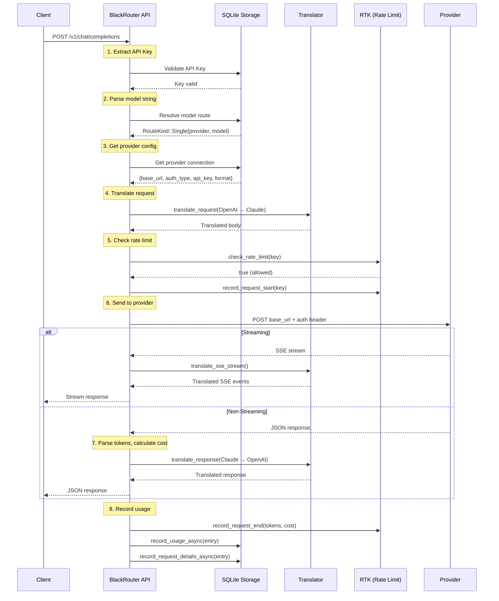

# Request Processing Pipeline

Tài liệu này mô tả chi tiết luồng xử lý request từ lúc nhận prompt đến khi trả về output trong BlackRouter.

## Tổng quan kiến trúc

```
┌─────────────────────────────────────────────────────────────────────────────────────┐
│                                    CLIENT                                           │
│  (Cursor, VS Code, CLI tools, Web apps, Telegram...)                                │
└─────────────────────────────────────────────────────────────────────────────────────┘
                                      │
                                      ▼
┌─────────────────────────────────────────────────────────────────────────────────────┐
│                              BLACKROUTER API LAYER                                  │
│  ┌──────────────┐  ┌──────────────┐  ┌──────────────┐  ┌──────────────┐            │
│  │   /v1/chat   │  │  /v1/responses│  │ /v1/messages │  │   /v1/models │            │
│  │ completions  │  │              │  │              │  │              │            │
│  └──────┬───────┘  └──────┬───────┘  └──────┬───────┘  └──────┬───────┘            │
│         └─────────────────┼─────────────────┼─────────────────┘                     │
│                           ▼                                                         │
│              ┌────────────────────────┐                                             │
│              │    Authorization       │                                             │
│              │   (API Key Check)      │                                             │
│              └───────────┬────────────┘                                             │
│                          ▼                                                          │
│              ┌────────────────────────┐                                             │
│              │   Route Resolution     │                                             │
│              │  (Model → Provider)    │                                             │
│              └───────────┬────────────┘                                             │
│                          ▼                                                          │
│              ┌────────────────────────┐                                             │
│              │  Request Translation   │                                             │
│              │ (OpenAI → Target fmt)  │                                             │
│              └───────────┬────────────┘                                             │
│                          ▼                                                          │
│              ┌────────────────────────┐                                             │
│              │    Rate Limiting       │                                             │
│              │     (RTK Check)        │                                             │
│              └───────────┬────────────┘                                             │
│                          ▼                                                          │
│              ┌────────────────────────┐                                             │
│              │   Provider Request     │                                             │
│              │   (HTTP to upstream)   │                                             │
│              └───────────┬────────────┘                                             │
│                          ▼                                                          │
│              ┌────────────────────────┐                                             │
│              │  Response Translation  │                                             │
│              │ (Target fmt → OpenAI)  │                                             │
│              └───────────┬────────────┘                                             │
│                          ▼                                                          │
│              ┌────────────────────────┐                                             │
│              │   Usage Recording      │                                             │
│              │  (Tokens, Cost, etc)   │                                             │
│              └────────────────────────┘                                             │
└─────────────────────────────────────────────────────────────────────────────────────┘
                                      │
                                      ▼
┌─────────────────────────────────────────────────────────────────────────────────────┐
│                              UPSTREAM PROVIDERS                                     │
│  ┌──────────┐ ┌──────────┐ ┌──────────┐ ┌──────────┐ ┌──────────┐ ┌──────────┐   │
│  │  OpenAI  │ │ Anthropic│ │  Gemini  │ │  DeepSeek│ │  Groq    │ │  Others  │   │
│  └──────────┘ └──────────┘ └──────────┘ └──────────┘ └──────────┘ └──────────┘   │
└─────────────────────────────────────────────────────────────────────────────────────┘
```

---

## Chi tiết từng bước

### 1. Client gửi Request

Client gửi request theo OpenAI-compatible format đến một trong các endpoints:

| Endpoint | Mô tả | Format |
|----------|--------|--------|
| `POST /v1/chat/completions` | Chat completions (phổ biến nhất) | OpenAI Chat |
| `POST /v1/responses` | Responses API (OpenAI mới) | OpenAI Responses |
| `POST /v1/messages` | Claude Messages API | Claude Messages |
| `GET /v1/models` | Liệt kê models | - |

**Ví dụ request:**
```json
POST /v1/chat/completions
Authorization: Bearer br_your_api_key

{
  "model": "openai/gpt-4o",
  "messages": [
    {"role": "system", "content": "You are a helpful assistant."},
    {"role": "user", "content": "Hello!"}
  ],
  "stream": true,
  "temperature": 0.7
}
```

---

### 2. Authorization (Xác thực API Key)

```
┌─────────────────┐     ┌─────────────────┐     ┌─────────────────┐
│  Extract API    │────▶│  Validate Key   │────▶│  Allow/Deny     │
│  Key from       │     │  against        │     │  Request        │
│  Header         │     │  SQLite DB      │     │                 │
└─────────────────┘     └─────────────────┘     └─────────────────┘
```

- Kiểm tra header `Authorization: Bearer <api_key>`
- Truy vấn bảng `apiKeys` trong SQLite
- Nếu key không hợp lệ → trả về `401 Unauthorized`

---

### 3. Route Resolution (Phân tích Model)

```
┌─────────────────────────────────────────────────────────────────┐
│                      Model String                                │
│                     "openai/gpt-4o"                              │
└───────────────────────────────┬─────────────────────────────────┘
                                │
                                ▼
                    ┌───────────────────────┐
                    │  Contains "/" ?        │
                    └───────────┬───────────┘
                       Yes      │      No
                       ▼        │       ▼
            ┌──────────────┐   │   ┌──────────────┐
            │ Parse as     │   │   │ Check alias  │
            │ provider/model│   │   │ table first  │
            └──────┬───────┘   │   └──────┬───────┘
                   │           │          │
                   │           │    Found │     Not found
                   │           │          ▼          │
                   │           │   ┌──────────────┐   │
                   │           │   │ Resolve to   │   │
                   │           │   │ provider/model│   │
                   │           │   └──────────────┘   │
                   │           │                      ▼
                   │           │              ┌──────────────┐
                   │           │              │ Look up as   │
                   │           │              │ Combo name   │
                   │           │              └──────┬───────┘
                   │           │                     │
                   ▼           │                     ▼
            ┌──────────────┐   │              ┌──────────────┐
            │ RouteKind::  │   │              │ RouteKind::  │
            │ Single       │   │              │ Combo        │
            └──────────────┘   │              └──────────────┘
                               │
```

**Ba loại routing:**

| Loại | Format | Ví dụ |
|------|--------|-------|
| **Single** | `provider/model` | `openai/gpt-4o`, `anthropic/claude-3.5-sonnet` |
| **Alias** | `alias_name` | `gpt4` → `openai/gpt-4o` (Phase 4.3) |
| **Combo** | `combo_name` | `fast` (fallback qua nhiều models) |

**Model Aliases** (Phase 4.3): Bảng `modelAliases` ánh xạ tên ngắn → `provider/model`. Phân giải trước combo.

**Combo** cho phép fallback: nếu model đầu tiên fail, hệ thống thử model tiếp theo.

---

### 4. Provider Lookup

```
┌─────────────────┐     ┌─────────────────┐     ┌─────────────────┐
│  Get Provider   │────▶│  Read Config    │────▶│  Determine      │
│  by name        │     │  (base_url,     │     │  Wire Format    │
│  from SQLite    │     │   auth_type,    │     │                 │
│                 │     │   api_key)      │     │                 │
└─────────────────┘     └─────────────────┘     └─────────────────┘
```

Truy vấn bảng `providerConnections` để lấy:
- `base_url`: URL của provider
- `auth_type`: `api-key` | `oauth` | `none`
- `data`: Chứa API key, format, và các config khác

---

### 5. Request Translation (Dịch request)

BlackRouter luôn nhận request ở **OpenAI Chat format** và dịch sang format của provider đích.

```
┌─────────────────────────────────────────────────────────────────┐
│                     OpenAI Chat Format                           │
│  {                                                               │
│    "model": "gpt-4o",                                           │
│    "messages": [{"role": "user", "content": "Hello"}],          │
│    "temperature": 0.7,                                          │
│    "stream": true                                               │
│  }                                                               │
└───────────────────────────────┬─────────────────────────────────┘
                                │
        ┌───────────────────────┼───────────────────────┐
        │                       │                       │
        ▼                       ▼                       ▼
┌───────────────┐      ┌───────────────┐      ┌───────────────┐
│ Claude        │      │ Gemini        │      │ OpenAI        │
│ Messages      │      │ Format        │      │ (passthrough) │
│ Format        │      │               │      │               │
└───────────────┘      └───────────────┘      └───────────────┘
```

**Các Wire Formats được hỗ trợ:**

| Format | Providers | Request Format |
|--------|-----------|----------------|
| `OpenAiChat` | OpenAI, DeepSeek, Groq, xAI, Mistral, Perplexity, Together, Fireworks, NVIDIA, OpenRouter | OpenAI Chat |
| `ClaudeMessages` | Anthropic | Claude Messages API |
| `Gemini` | Gemini | Gemini generateContent |
| `GeminiCli` | Gemini CLI | Gemini CLI format |
| `Antigravity` | Google Antigravity | Antigravity internal |
| `CommandCode` | Command Code | CommandCode format |
| `Cursor` | Cursor | Cursor format |
| `Kiro` | Kiro | Kiro format |
| `OpenAIResponses` | Codex | OpenAI Responses API |

**Ví dụ dịch OpenAI → Claude:**

```json
// OpenAI format (input)
{
  "model": "claude-3.5-sonnet",
  "messages": [
    {"role": "system", "content": "You are helpful."},
    {"role": "user", "content": "Hello!"}
  ],
  "max_tokens": 1024
}

// Claude format (output)
{
  "model": "claude-3.5-sonnet",
  "system": "You are helpful.",
  "messages": [
    {"role": "user", "content": "Hello!"}
  ],
  "max_tokens": 1024
}
```

---

### 6. Rate Limiting (Giới hạn tốc độ)

```
┌─────────────────┐     ┌─────────────────┐     ┌─────────────────┐
│  Check Rate     │────▶│  - Requests/min │────▶│  Allow (200)    │
│  Limit          │     │  - Tokens/min   │     │  or Queue       │
│  (RTK)          │     │  - Concurrent   │     │  (retry 3x)     │
└─────────────────┘     └─────────────────┘     └─────────────────┘
```

**Default limits:**
- 60 requests/minute
- 100,000 tokens/minute
- 10 concurrent requests

**Request Queuing** (Phase 4.3): Nếu vượt quá rate limit, hệ thống thử lại 3 lần với 500ms interval thay vì reject ngay. Chỉ trả `429` nếu vẫn vượt sau 3 lần retry.

Rate limit headers:
```
x-ratelimit-limit-requests: 60
x-ratelimit-remaining-requests: 45
x-ratelimit-reset-requests: 0
x-ratelimit-limit-tokens: 100000
x-ratelimit-remaining-tokens: 85000
```

---

### 7. Load Balancing + Provider Request

```
┌─────────────────────────────────────────────────────────────────┐
│                    Lấy tất cả active providers                   │
│              list_active_provider_connections()                  │
└───────────────────────────────┬─────────────────────────────────┘
                                │
                                ▼
                    ┌───────────────────────┐
                    │  Filter circuit-broken │
                    │  is_circuit_open()     │
                    └───────────┬───────────┘
                                │
                                ▼
                    ┌───────────────────────┐
                    │  Select via LB strategy│
                    │  (round-robin, etc.)   │
                    └───────────┬───────────┘
                                │
                    ┌───────────┴───────────┐
                    │                       │
                    ▼                       ▼
          ┌───────────────┐        ┌───────────────┐
          │  Send Request  │        │  On failure:  │
          │  to Provider   │        │  record CB    │
          │                │        │  failure,     │
          └───────┬───────┘        │  try next     │
                  │                └───────────────┘
                  ▼
          ┌───────────────┐
          │  On success:   │
          │  record CB     │
          │  success       │
          └───────────────┘
```

**Load Balancing** (Phase 4.1):

| Strategy | Mô tả |
|----------|--------|
| `round_robin` | Xoay vòng qua providers |
| `weighted_round_robin` | Ưu tiên theo priority |
| `least_connections` | Ít concurrent nhất |
| `response_time` | Latency thấp nhất |

**Circuit Breaker** (Phase 4.1):

| State | Mô tả |
|-------|--------|
| `Closed` | Bình thường — request đi qua |
| `Open` | 5 lần fail liên tiếp → reject, chờ 30s |
| `HalfOpen` | Sau cooldown — thử 1 request |

**API endpoint quản lý LB strategy:**
```
GET  /api/setup/lb-strategy  → Lấy strategy hiện tại
PUT  /api/setup/lb-strategy  → Đổi strategy
```

**Authentication theo loại:**

| Auth Type | Header |
|-----------|--------|
| `api-key` | `Authorization: Bearer <api_key>` hoặc `x-api-key: <api_key>` |
| `oauth` | `Authorization: Bearer <oauth_token>` |
| `none` | Không có auth header |

**Đặc biệt cho Antigravity:**
- Thêm header `User-Agent: antigravity/1.107.0`
- Thêm header `x-request-source: local`
- Thêm `project` và `requestId` vào body
- Streaming endpoint: `/v1internal:streamGenerateContent?alt=sse`

---

### 8. Xử lý Response

```
┌─────────────────────────────────────────────────────────────────┐
│                    Response từ Provider                          │
└───────────────────────────────┬─────────────────────────────────┘
                                │
                    ┌───────────┴───────────┐
                    │                       │
                    ▼                       ▼
          ┌───────────────┐        ┌───────────────┐
          │  Streaming    │        │  Non-Streaming │
          │  (SSE)        │        │  (JSON)        │
          └───────┬───────┘        └───────┬───────┘
                  │                        │
                  ▼                        ▼
          ┌───────────────┐        ┌───────────────┐
          │ Translate SSE │        │ Translate     │
          │ events        │        │ full response │
          │ event-by-event│        │               │
          └───────┬───────┘        └───────┬───────┘
                  │                        │
                  ▼                        ▼
          ┌───────────────┐        ┌───────────────┐
          │ Stream to     │        │ Parse tokens  │
          │ client        │        │ Calculate cost│
          └───────────────┘        └───────────────┘
```

#### Streaming Path (stream: true)

1. **Passthrough** (OpenAI → OpenAI): Forward bytes trực tiếp, zero-copy
2. **Translated** (OpenAI → Claude/Gemini): Dịch SSE events real-time

**SSE Translation State Machine:**
```
┌─────────────┐     ┌─────────────┐     ┌─────────────┐
│ message_start│────▶│content_block│────▶│  content_   │
│ (emit role) │     │  _start     │     │  delta      │
└─────────────┘     └─────────────┘     └──────┬──────┘
                                               │
                                               ▼
                    ┌─────────────┐     ┌─────────────┐
                    │message_stop │◀────│content_block│
                    │ (emit       │     │  _stop      │
                    │  [DONE])    │     │             │
                    └─────────────┘     └─────────────┘
```

#### Non-Streaming Path (stream: false)

1. Đọc toàn bộ response bytes
2. Parse token usage từ response
3. Tính cost dựa trên bảng giá
4. Dịch response về OpenAI format
5. Trả về JSON response

---

### 9. Response Translation (Dịch response)

Dịch response từ provider format về OpenAI Chat format:

```json
// Claude response (input)
{
  "id": "msg_...",
  "type": "message",
  "content": [{"type": "text", "text": "Hello!"}],
  "usage": {"input_tokens": 10, "output_tokens": 5}
}

// OpenAI response (output)
{
  "id": "chatcmpl-...",
  "object": "chat.completion",
  "choices": [{
    "index": 0,
    "message": {"role": "assistant", "content": "Hello!"},
    "finish_reason": "stop"
  }],
  "usage": {"prompt_tokens": 10, "completion_tokens": 5, "total_tokens": 15}
}
```

---

### 10. Response Caching (Phase 4.2)

```
┌─────────────────┐     ┌─────────────────┐     ┌─────────────────┐
│  Is cacheable?  │────▶│  Generate key   │────▶│  Store in LRU   │
│  - non-stream   │     │  sha256(model + │     │  cache (TTL 5m) │
│  - temp=0       │     │  messages +     │     │  max 1000 items │
│  - no tools     │     │  params)        │     │                 │
└─────────────────┘     └─────────────────┘     └─────────────────┘
```

**Cache hit** → trả response ngay, không gọi provider (0ms latency)

**Cache miss** → gọi provider bình thường, lưu response vào cache

**Cache key:** `sha256(provider + model + messages + max_tokens + top_p + frequency_penalty)`

---

### 11. Usage Recording (Ghi nhận sử dụng)

```
┌─────────────────┐     ┌─────────────────┐     ┌─────────────────┐
│  Parse Token    │────▶│  Calculate      │────▶│  Record to      │
│  Usage          │     │  Cost           │     │  SQLite (async) │
│                 │     │                 │     │                 │
└─────────────────┘     └─────────────────┘     └─────────────────┘
```

**Token parsing theo format:**

| Format | Prompt Tokens | Completion Tokens |
|--------|---------------|-------------------|
| OpenAI | `usage.prompt_tokens` | `usage.completion_tokens` |
| Claude | `usage.input_tokens` | `usage.output_tokens` |
| Gemini | `usageMetadata.promptTokenCount` | `usageMetadata.candidatesTokenCount` |

**Cost calculation:**
- Bảng giá per 1M tokens (USD)
- Ví dụ: GPT-4o = $2.50/1M prompt + $10.00/1M completion

**Ghi vào SQLite:**
- Bảng `usageHistory`: Chi tiết từng request
- Bảng `usageDaily`: Tổng hợp theo ngày

---

### 12. Prometheus Metrics

Ghi nhận metrics cho monitoring:

```
blackrouter_requests_total{provider, model, status}    # Counter
blackrouter_request_duration_seconds{provider, model}  # Histogram
blackrouter_stream_ttfb_seconds{provider, model}       # Histogram
blackrouter_tokens_total{provider, model, type}        # Counter
blackrouter_open_connections                           # Gauge
```

---

## Luồng xử lý đầy đủ (Sequence Diagram)



---

## Ví dụ cụ thể

### Case 1: OpenAI → OpenAI (Passthrough)

```
Client: POST /v1/chat/completions
        {model: "openai/gpt-4o", messages: [...], stream: true}

BlackRouter:
  1. Validate API key ✓
  2. Parse "openai/gpt-4o" → provider="openai", model="gpt-4o"
  3. Get provider config: base_url=https://api.openai.com/v1/chat/completions
  4. No translation needed (passthrough)
  5. Rate limit check ✓
  6. Forward request to OpenAI with Bearer sk-...
  7. Stream response directly to client (zero-copy)
  8. Record usage

Client: Receives SSE stream from OpenAI
```

### Case 2: OpenAI → Claude (Translation)

```
Client: POST /v1/chat/completions
        {model: "anthropic/claude-3.5-sonnet", messages: [...], stream: false}

BlackRouter:
  1. Validate API key ✓
  2. Parse "anthropic/claude-3.5-sonnet" → provider="anthropic", model="claude-3.5-sonnet"
  3. Get provider config: base_url=https://api.anthropic.com/v1/messages, format=claude
  4. Translate: OpenAI → Claude Messages format
     - Extract system message
     - Convert messages format
  5. Rate limit check ✓
  6. Send to Anthropic with x-api-key header
  7. Receive Claude response
  8. Parse tokens: input_tokens, output_tokens
  9. Calculate cost: $3/1M prompt + $15/1M completion
  10. Translate: Claude → OpenAI response format
  11. Return to client

Client: Receives OpenAI-format response
```

### Case 3: Combo Fallback

```
Client: POST /v1/chat/completions
        {model: "fast", messages: [...], stream: true}

BlackRouter:
  1. Validate API key ✓
  2. Parse "fast" → no "/" → lookup combo "fast"
  3. Combo "fast" = ["groq/llama-3.1-70b", "openai/gpt-4o-mini"]
  4. Try groq/llama-3.1-70b:
     - Translate request
     - Send to Groq
     - Error: 429 Rate Limited
  5. Fallback to openai/gpt-4o-mini:
     - Translate request
     - Send to OpenAI
     - Success!
  6. Stream response to client

Client: Receives response from fallback model
```

---

## Các endpoints khác

| Endpoint | Method | Mô tả |
|----------|--------|--------|
| `/health` | GET | Health check |
| `/version` | GET | Version info |
| `/metrics` | GET | Prometheus metrics |
| `/v1/models` | GET | List available models |
| `/api/setup/*` | Various | Setup & configuration |
| `/api/setup/aliases` | GET/POST | Model alias management (Phase 4.3) |
| `/api/setup/aliases/{id}` | PUT/DELETE | Update/delete alias |
| `/api/setup/lb-strategy` | GET/PUT | Load balancing strategy (Phase 4.1) |
| `/api/usage` | GET | Usage statistics |
| `/api/rtk/metrics` | GET | Rate limit metrics |
| `/api/oauth/*/start` | POST | Start OAuth flow |
| `/telegram/webhook` | POST | Telegram webhook |

---

## Tích hợp Hermes Agent

### Tổng quan

[Hermes Agent](https://github.com/nousresearch/hermes-agent) là Python-based AI agent sử dụng BlackRouter làm LLM gateway. Đây là **first-class client** của BlackRouter.

```
┌─────────────────────────────────────────────────────────────────────────┐
│                         HERMES AGENT (Python)                           │
│  - Task planning & execution                                           │
│  - Tool calling (file ops, shell, web search...)                       │
│  - Subagent parallelism                                                │
│  - Context compression (/compress)                                     │
└─────────────────────────────────────────────────────────────────────────┘
                                    │
                                    │ POST /v1/chat/completions
                                    │ Authorization: Bearer <blackrouter-key>
                                    │ { "model": "openai/gpt-4o",
                                    │   "stream": true,
                                    │   "tools": [...],
                                    │   "tool_choice": "auto" }
                                    ▼
┌─────────────────────────────────────────────────────────────────────────┐
│                         BLACKROUTER (Rust)                               │
│  - API Key validation                                                  │
│  - Route resolution (single / combo fallback)                          │
│  - Format translation (OpenAI ↔ Claude ↔ Gemini)                      │
│  - Tool call passthrough                                               │
│  - Streaming SSE forward                                               │
│  - Rate limiting + metrics                                             │
│  - Token usage tracking                                                │
└─────────────────────────────────────────────────────────────────────────┘
                                    │
                                    ▼
┌─────────────────────────────────────────────────────────────────────────┐
│                         UPSTREAM PROVIDERS                               │
│  OpenAI | Claude | Gemini | OpenRouter | DeepSeek | Groq ...           │
└─────────────────────────────────────────────────────────────────────────┘
```

### Tại sao dùng BlackRouter cho Hermes?

| Lợi ích | Mô tả |
|---------|--------|
| **Combo Fallback** | Provider lỗi tự chuyển sang model B |
| **Format Translation** | Hermes nói OpenAI format, BlackRouter dịch sang Claude/Gemini |
| **Rate Limiting** | Giới hạn request/token per minute tập trung |
| **Key Management** | Quản lý API keys tập trung (single source of truth) |
| **Usage Tracking** | Theo dõi token usage, cost cho context compression |
| **Multi-Provider** | Truy cập nhiều providers qua 1 endpoint |

### Cấu hình Hermes

```yaml
# Hermes config → trỏ vào BlackRouter
provider: openai-compatible
base_url: http://blackrouter:20130/v1
api_key: <blackrouter-api-key>
model: openai/gpt-4o  # hoặc anthropic/claude-3.5-sonnet, gemini/gemini-2.0-flash
```

```bash
# Hoặc qua CLI
hermes model
# → Choose: Custom OpenAI-compatible endpoint
# → Base URL: http://blackrouter:20130/v1
# → API Key: <blackrouter-api-key>
```

### Luồng xử lý Hermes Request

```
┌─────────────────────────────────────────────────────────────────────────┐
│ 1. Hermes gửi request                                                   │
│    POST /v1/chat/completions                                           │
│    {model: "openai/gpt-4o", tools: [...], tool_choice: "auto",         │
│     stream: true, messages: [...]}                                     │
└───────────────────────────────────────────┬─────────────────────────────┘
                                            │
                                            ▼
┌─────────────────────────────────────────────────────────────────────────┐
│ 2. BlackRouter xử lý                                                    │
│    - Validate API key                                                  │
│    - Parse model → provider="openai", model="gpt-4o"                   │
│    - Route = Single                                                    │
│    - Check rate limit                                                  │
│    - Forward request (passthrough vì cùng OpenAI format)               │
│    - Stream response về Hermes                                         │
└─────────────────────────────────────────────────────────────────────────┘
                                            │
                                            ▼
┌─────────────────────────────────────────────────────────────────────────┐
│ 3. Hermes nhận response                                                │
│    - Stream SSE chunks                                                │
│    - Parse tool_calls từ response                                     │
│    - Execute tools                                                     │
│    - Gửi tool results về LLM                                          │
│    - Lặp lại cho đến khi hoàn thành task                              │
└─────────────────────────────────────────────────────────────────────────┘
```

### Tool Call Flow

Hermes sử dụng OpenAI tool calling format. BlackRouter **passthrough** tool calls nguyên vẹn:

```json
// Hermes gửi request với tools
{
  "model": "openai/gpt-4o",
  "messages": [{"role": "user", "content": "Create a file hello.py"}],
  "tools": [
    {
      "type": "function",
      "function": {
        "name": "write_file",
        "parameters": {
          "type": "object",
          "properties": {
            "path": {"type": "string"},
            "content": {"type": "string"}
          }
        }
      }
    }
  ],
  "tool_choice": "auto",
  "stream": true
}
```

```json
// LLM trả về tool call (streamed qua BlackRouter)
{
  "choices": [{
    "delta": {
      "tool_calls": [{
        "index": 0,
        "id": "call_abc123",
        "type": "function",
        "function": {
          "name": "write_file",
          "arguments": "{\"path\": \"hello.py\", \"content\": \"print('Hello!')\"}"
        }
      }]
    }
  }]
}
```

### Token Usage cho Context Compression

Hermes sử dụng `/api/usage` và token count để quyết định khi nào cần compress context:

```bash
# Hermes kiểm tra token usage
curl http://blackrouter:20130/api/usage

# Response
{
  "rows": [
    {
      "provider": "openai",
      "model": "gpt-4o",
      "prompt_tokens": 50000,
      "completion_tokens": 25000,
      "cost": 0.375
    }
  ]
}
```

Khi token count gần đạt context window limit → Hermes gọi `/compress` để nén context.

### Hermes Blocker Matrix

Các tính năng **bắt buộc** để Hermes hoạt động ổn định:

| Tính năng | Status | Mức độ | Lý do |
|-----------|--------|--------|-------|
| Streaming SSE | ✅ Done | 🔴 P0 | Không stream = Hermes treo khi agent chạy tool |
| Tool call passthrough | ✅ Done | 🔴 P0 | Agent không gọi tool được = không hoạt động |
| Connection pooling | ✅ Done | 🟡 P1 | Shared HTTP client trong AppState |
| Token usage tracking | ✅ Done | 🟡 P1 | Hermes /compress cần token count để nén context |
| `/v1/responses` proxy | ✅ Done | 🟡 P1 | Một số model yêu cầu Responses API |
| `/v1/messages` proxy | ✅ Done | 🟡 P1 | Claude-native endpoint cho Hermes |
| Long-running timeout | ✅ Done | 🟡 P1 | 600s timeout cho tool exec + subagent |

### Ví dụ: Hermes Multi-Step Task

```
User: "Create a Python script that reads data.csv and generates a chart"

Step 1: Hermes → BlackRouter → OpenAI
  Request: {messages: [{role: "user", content: "..."}], tools: [read_file, write_file, ...]}
  Response: tool_call: read_file("data.csv")

Step 2: Hermes executes read_file → gets CSV content

Step 3: Hermes → BlackRouter → OpenAI
  Request: {messages: [..., {role: "tool", content: "CSV data..."}], tools: [...]}
  Response: tool_call: write_file("chart.py", "import pandas...\nimport matplotlib...")

Step 4: Hermes executes write_file

Step 5: Hermes → BlackRouter → OpenAI
  Request: {messages: [..., {role: "tool", content: "File created"}]}
  Response: {content: "I've created chart.py that reads data.csv..."}

Total: 3 LLM calls qua BlackRouter, mỗi call stream về real-time
```
